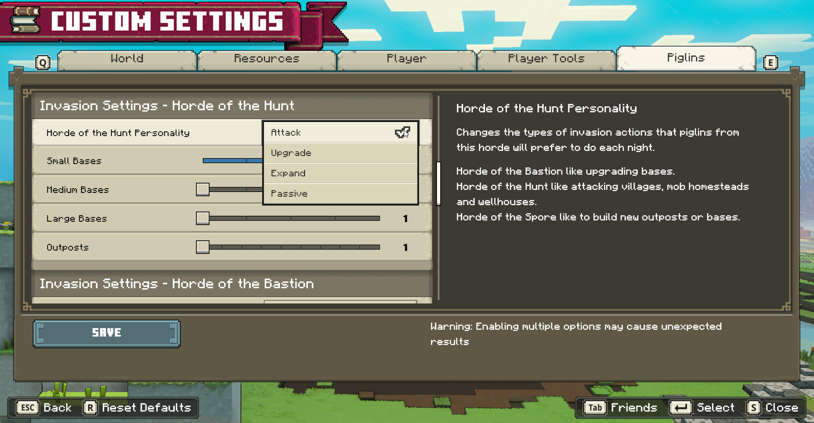

# Minecraft Legends - Custom Game Settings



**Figure 1:** Screenshot of custom settings screen

## What are custom game settings?

Campaign and PVP have separate 'custom' game modes that feature a wide variety of settings to adjust various gameplay systems. These can range from player unit and enemy behaviors, starting and max resources, available structures, etc.

The data for these custom settings lives in `resource_packs/badger_base/gamelayer/launcher/custom_game_settings.json`

## How to add a custom game setting?

Adding a custom game setting is done through a combination of adding Custom Settings Data as well as data that reads the value of the setting to apply its effects in game. Both of these aspects are explained in greater detail below.

The vast majority of custom game settings that already exist are configured this way and can serve as examples for additional options. Note however that options such as 'world_world_seed' and 'world_world_size' have specific functionality in the game's engine which are not accessible.

### Custom Settings Data


### Using Custom Settings

After a custom game setting has been added [to the service? See what Allie has written above], it should appear in the front end when starting a new custom game, or loading a previously saved one in the case of custom campaigns. When the game is started (from the lobby) each setting and their values will be stored on the server and saved along with other game data.

The values for each custom game setting can be used with entity archetype data and/or in B# scripts.

#### Entity Archetypes


#### B# Scripts

*This section only covers specifically how custom game settings are used within B# scripts. For a better idea how B# is used generally, check out the [B# Reference Sheet](https://github.com/Mojang/minecraft-legends-docs/blob/main/BSharpReferenceSheet.md#b-reference-sheet)*

When the game is started from the lobby and the values of each setting have been receieved, each value is provided to scripts through a special bootstrap snippet **SNIPPET_GameSettingInitialized** wherever the custom game setting's name matches the first argument of the snippet.

```
SNIPPET_GameSettingInitialized("custom_game_setting_name", (value) => {
    const settingvalue = value.value

    // Do stuff with the setting's value
})
```

These snippets trigger before any other bootstrap snippets so that their effects can be applied before they are used anywhere else. This can be helpful in cases where things like data structures need to be altered with the provided value(s).

These snippets also trigger every time a game mode is launched, either from a new game or one that was previously saved. Since B# script files are always parsed at this time, previous changes in scripts that are not saved need to be re-applied each time a saved game is loaded to keep the behaviour consistent.


Note (for Devon): These settings have special handling in the game's engine which is not accessible through data:
- world_world_seed
- world_world_size
- world_world_mirror
