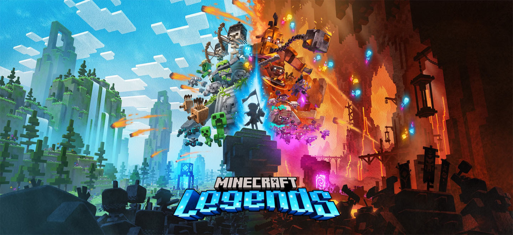

# Minecraft Legends Documentation

Welcome to the official Minecraft Legends documentation repository! Here, you'll find everything you need to understand the game's data structure and create your own mods. Whether you're a seasoned modder or just getting started, this documentation is designed to provide clear guidance.

We’re constantly expanding our documentation, so stay tuned for updates. Currently, you can explore the various behaviors that define entities in Minecraft Legends.

## Table of Contents

1. [Entities](#entities)
   - [Event Triggers](#event-triggers)
2. [Blockbench Plugin](#blockbench-plugin)
3. [World Generation](#world-generation)
   - [Village Generation](#village-generation)
   - [Geology Service](#geology-service)
4. [Barrier Blocks](#barrier-blocks)
5. [BSharp Scripting](#bsharp-scripting)
6. [Wolverine](#wolverine)
7. [Contributing](CONTRIBUTING.md)

## 📖 Overview

## Entities

In Minecraft Legends, gameplay revolves around entities — from Piglins attacking the overworld to allays gathering resources. Entities can be thought of as objects with behavior, whether or not they have a visual representation. These entities are configured using JSON files, which are divided between **Behavior Packs** (defining logic) and **Resource Packs** (defining visuals and assets).

For a detailed explanation of entities, check out the [Entities Documentation](Entities.md).

## Event Triggers

[Event Triggers](EventTriggers.md) breathe life into entities by enabling them to react to gameplay events. Whether it's triggering animations, playing audio, or spawning particles, event triggers are responsible for all of these in-game interactions.

## Blockbench Plugin

[Blockbench](https://www.blockbench.net/) is a free, powerful tool for creating models and animations for Minecraft. We’ve developed a specialized Minecraft Legends plugin for Blockbench that allows seamless export of models and animations into JSON format for use in Minecraft Legends Resource Packs. To learn more about using this plugin and how to integrate models into the game, visit our [Blockbench Documentation](BlockBench.md).

## World Generation

Minecraft Legends’ world is procedurally generated, making every adventure unique. The [World Placement](WorldPlacement.md) system is at the heart of this process, controlling how biomes and features are distributed. This system determines the placement of [blocks](Blocks.md) across the voxel-based world.

### Village Generation

Villages and enemy bases play crucial roles in Minecraft Legends’ campaign mode. They are procedurally generated using the deck system, which leverages a card-drawing mechanism to create a dynamic set of structures. Learn more on the [Village Generation](VillageGeneration.md) page.

### Geology Service

The [Geology Service](GeologyService.md) lets us add special geology textures and features into the game world. This system enables terrain generation that goes beyond standard voxel terrain and adds distinct features.

## Barrier Blocks

Special types of [barrier blocks](BarrierBlocks.md) are used to create collision systems for various structures in Minecraft Legends, helping to control entity movement and interactions.

## BSharp Scripting

Our custom scripting language, **BSharp**, built on JavaScript, handles the bulk of campaign mode logic. BSharp provides modders with powerful tools for scripting in-game mechanics. For details, see the [BSharp Reference Sheet](BSharpReferenceSheet.md).

## Wolverine

**NOTE**: The Wolverine tool itself has yet to be released, but for those curious they may access the documentation in the meanwhile.

[Wolverine](Wolverine.md) is a versatile structure conversion tool for converting structures between Minecraft (Bedrock and Java) and Minecraft Lengeds. Taking `.nbt`, `.mcstructure`, or `.schematic` files made in Minecraft as input, this tool will create Minecraft Legends formatted structures to be used by creators in making their own Packs!

---

We hope you find this documentation helpful and encourage you to explore the additional resources listed throughout. Stay tuned for further updates, and don’t hesitate to contribute!
